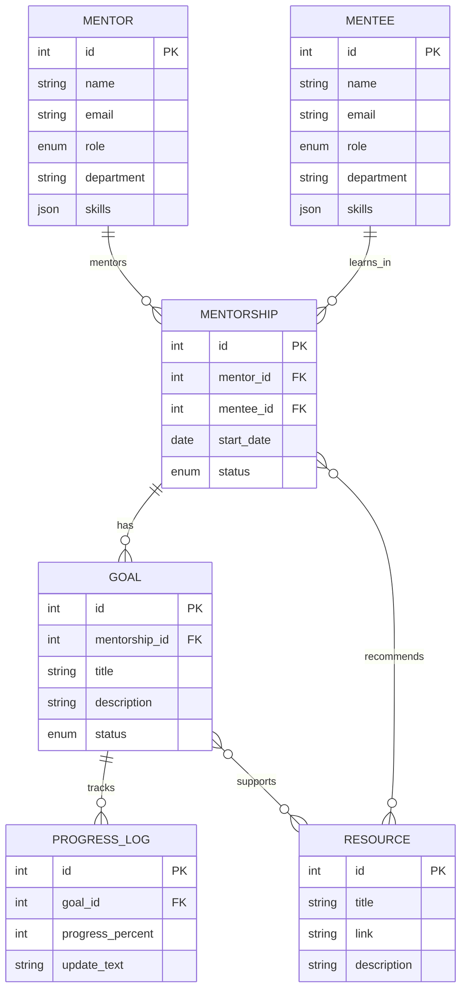
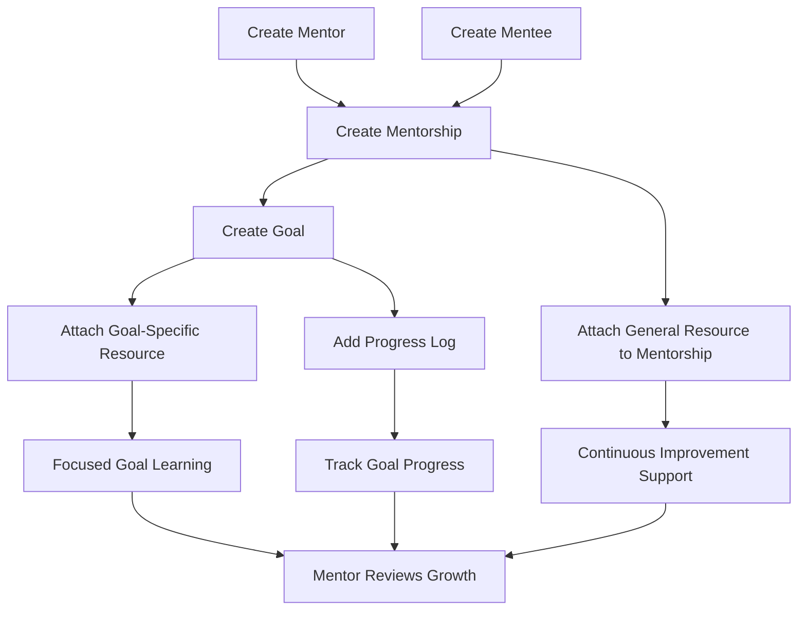

# Mentor-Mentee Growth Platform Diagrams

## ER Diagram

## Flow Diagram

## Demo Explanation

- `Mentorship -> Resource` means a general recommendation for ongoing improvement.
- `Goal -> Resource` means a targeted learning resource for one specific goal.
- `ProgressLog` shows how the mentee is moving toward a goal over time.

Example:

- Mentorship resource: `PPT Design Basics`
- Goal: `Learn FastAPI`
- Goal resource: `FastAPI Tutorial`

