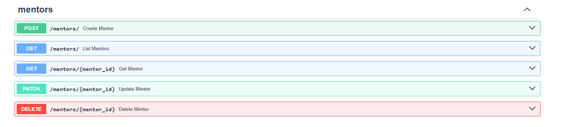
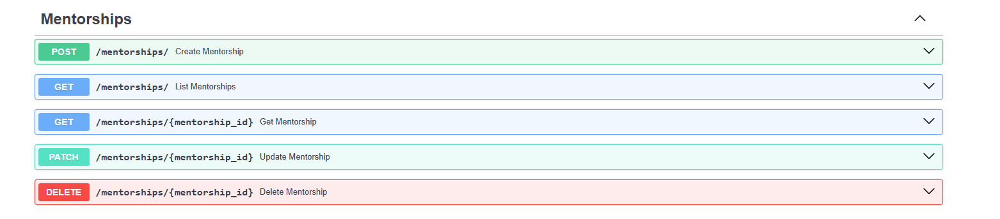

# Hackathon_Mentor_Mentee

1.Create venv:
```bash
    py -3.12 -m venv .venv
```

```bash
    python -m venv .venv
```

2. Activate it:

```bash
    .\\.venv\Scripts\activate.ps1
```

3. Install packages

```bash
    pip install -r requirements.txt
```


4. Run the app

```bash
    uvicorn main:app --reload
```

 

# Create DB and configuration

```bash
CREATE DATABASE IF NOT EXISTS mentorship_db
    CHARACTER SET utf8mb4
    COLLATE utf8mb4_unicode_ci;

CREATE USER IF NOT EXISTS 'mentorship_user'@'localhost' IDENTIFIED BY 'mentorship_pass';
GRANT ALL PRIVILEGES ON mentorship_db.* TO 'mentorship_user'@'localhost';
FLUSH PRIVILEGES;
```

# Mentee Endpoints:


# Mentor Endpoints:




# Mentorship Endpoints(Mentor <-> Mentee):

Mentorship is the relationship layer

It answers questions like:

Which mentor is assigned to which mentee?

Is this mentorship active or ended?

When did the mentorship start?



# Goals Endpoints:


# Resource Endpoints:(Optional)


# Skill Endpoints:(Optional)