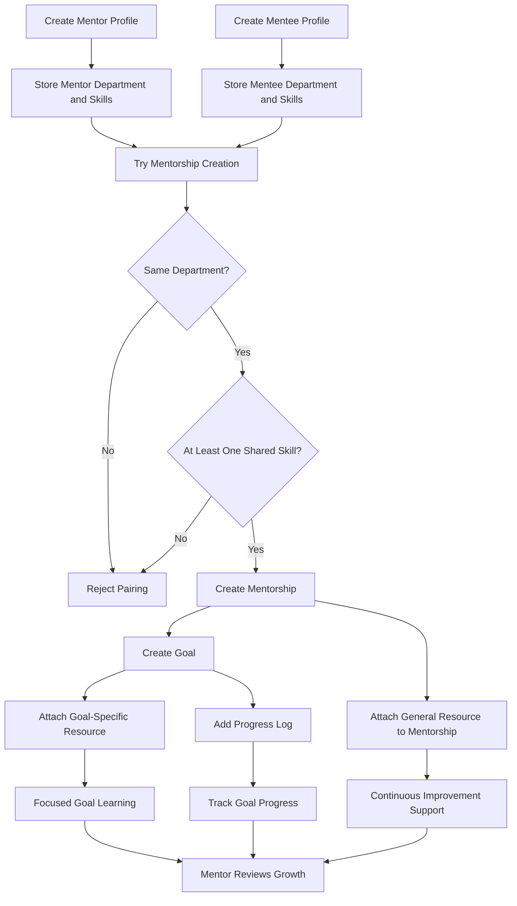

# Mentor-Mentee Growth Platform Diagrams

## Flow Diagram

```mermaid
flowchart TD
    A["Create Mentor Profile"] --> C["Store Mentor Department and Skills"]
    B["Create Mentee Profile"] --> D["Store Mentee Department and Skills"]
    C --> E["Try Mentorship Creation"]
    D --> E
    E --> F{"Same Department?"}
    F -- "No" --> X["Reject Pairing"]
    F -- "Yes" --> G{"At Least One Shared Skill?"}
    G -- "No" --> X
    G -- "Yes" --> H["Create Mentorship"]
    H --> I["Create Goal"]
    H --> J["Attach General Resource to Mentorship"]
    I --> K["Attach Goal-Specific Resource"]
    I --> L["Add Progress Log"]
    L --> M["Track Goal Progress"]
    J --> N["Continuous Improvement Support"]
    K --> O["Focused Goal Learning"]
    M --> P["Mentor Reviews Growth"]
    N --> P
    O --> P
```
