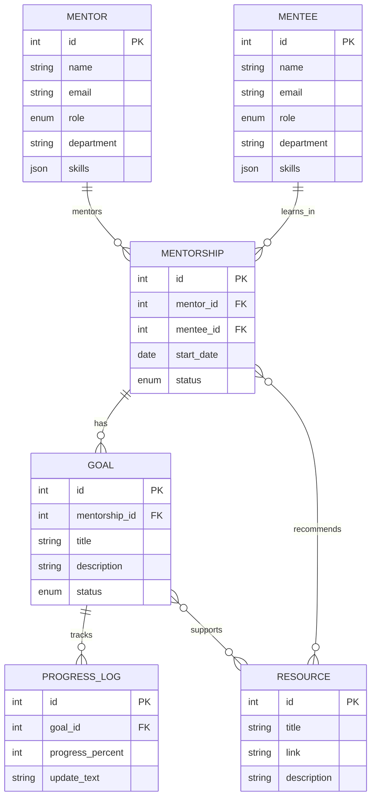
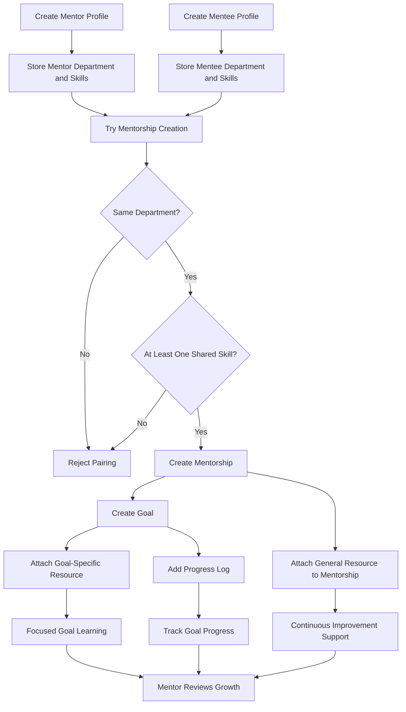

# Mentor-Mentee Growth Platform Diagrams

## ER Diagram

### Pairing Rule Note

- A `Mentorship` can be created only when:
  - `Mentor.department == Mentee.department`
  - `Mentor.skills` and `Mentee.skills` have at least one overlapping value

This rule is application logic enforced during mentorship creation. It does not require a separate matching table in the current design.

## Flow Diagram

## Demo Explanation

- `Mentorship -> Resource` means a general recommendation for ongoing improvement.
- `Goal -> Resource` means a targeted learning resource for one specific goal.
- `ProgressLog` shows how the mentee is moving toward a goal over time.
- `Mentorship` is created only if mentor and mentee match on department and share at least one skill.

Example:

- Mentorship resource: `PPT Design Basics`
- Goal: `Learn FastAPI`
- Goal resource: `FastAPI Tutorial`
